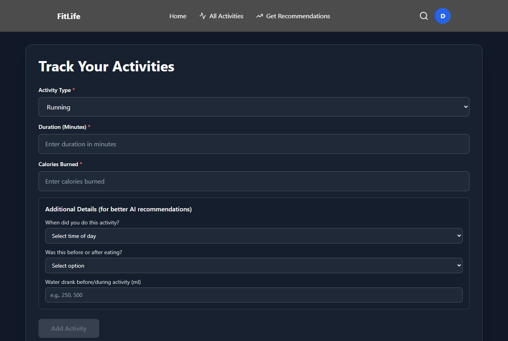
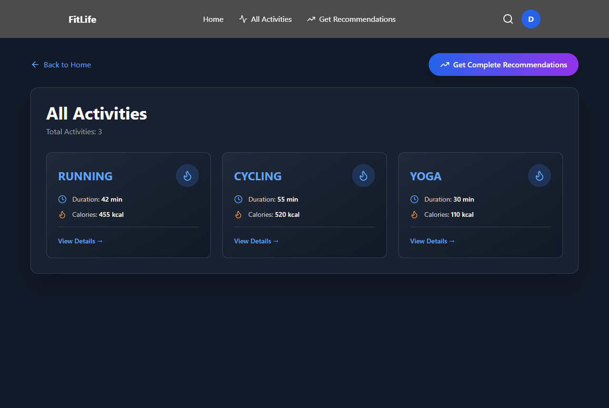
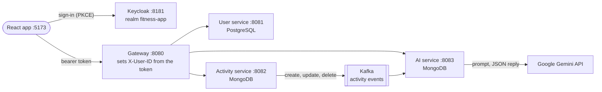
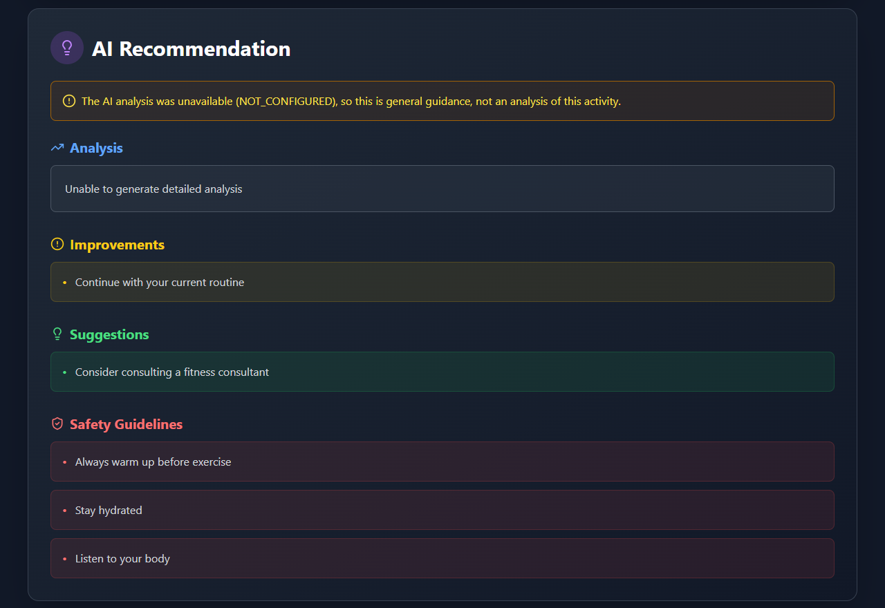

# FitLife — AI Fitness Platform

A fitness tracker built as Spring Boot microservices: users sign in with Keycloak, log workouts, and
get a recommendation for each workout from Google Gemini, generated asynchronously through Kafka.

[](https://github.com/Nehabandari12/fitlife-ai-platform/actions/workflows/ci.yml)

**Status:** a personal project that runs locally (Docker Compose for the infrastructure, the services
on the host). It is not deployed. Verified end to end on 6 Oct 2026; see [Verification](#verification).

| Log a workout | Workout history |
|---|---|
|  |  |

The screenshots show a synthetic demo user.

## What it does

| Capability | How | Evidence |
|---|---|---|
| Sign-in | Keycloak, OAuth 2.0 authorization code with PKCE from the React app; sign-up through the gateway | [KeycloakAdminClient.java](gateway/src/main/java/com/fitness/gateway/KeycloakAdminClient.java), [e2e_check.py](scripts/e2e_check.py) |
| Per-user data | every service validates the access token and takes the user from its subject; another user's records look like missing ones | [ActivityOwnershipTest](activityservice/src/test/java/com/fitness/activityservice/controller/ActivityOwnershipTest.java), [RecommendationAccessTest](aiservice/src/test/java/com/fitness/aiservice/controller/RecommendationAccessTest.java), [UserAccessTest](userservice/src/test/java/com/fitness/userservice/controller/UserAccessTest.java) |
| Workouts | create, list, read, update and delete activities (MongoDB) | [ActivityService.java](activityservice/src/main/java/com/fitness/activityservice/service/ActivityService.java) |
| AI recommendations | each create or update event goes through Kafka to the AI service, which prompts Gemini for JSON and validates it; failures are stored as a marked fallback with the reason | [ActivityAIService.java](aiservice/src/main/java/com/fitness/aiservice/service/ActivityAIService.java), [GeminiServiceTest](aiservice/src/test/java/com/fitness/aiservice/service/GeminiServiceTest.java) |
| Summary | one combined recommendation over a user's history, on request | [RecommendationService.java](aiservice/src/main/java/com/fitness/aiservice/service/RecommendationService.java) |

## Architecture



Service discovery (Eureka, port 8761) and configuration (Spring Cloud Config, port 8888) sit beside
these; every service reads its settings from [configserver/src/main/resources/config](configserver/src/main/resources/config).

Three decisions shape it:

1. **Every service checks the token, not only the gateway.** The gateway drops any `X-User-ID` a client
   sends and sets it from the validated token, and the user, activity and AI services are OAuth2
   resource servers themselves: a request that skips the gateway still needs a valid token, and the
   user is always the token's subject.
2. **Recommendations are asynchronous and at-least-once.** Saving a workout returns at once; the AI
   service consumes the event, upserts the recommendation by activity id (a duplicate event never
   creates a second record), drops events for activities already deleted, and retries a failing event
   3 times before logging and skipping it.
3. **The model's reply is untrusted input.** It must parse as the JSON the prompt asks for; anything
   else, a timeout, an HTTP error or a blocked prompt becomes a `FALLBACK` recommendation with the
   reason, which the UI shows. Prompts and replies are not logged, and the user id is not sent to Gemini.

   This is what a user sees when no Gemini key is configured; with a key, the same panel shows the
   model's analysis, improvements, suggestions and safety notes:

   

## Quickstart

Needs Docker, JDK 21 or newer, and Node.js 20.19+ or 22.12+ (Vite 7). A Gemini key from
[Google AI Studio](https://aistudio.google.com/apikey) is optional. Every other setting has a local
default; see [.env.example](.env.example).

**1. Infrastructure** (PostgreSQL, MongoDB, Kafka, Keycloak with the `fitness-app` realm imported):

```bash
docker compose up -d --wait
```

**2. Build the six services** (from the repository root):

```bash
# macOS / Linux
for s in configserver eureka userservice activityservice aiservice gateway; do (cd "$s" && ./mvnw -q -DskipTests package); done
```

```powershell
# Windows (PowerShell)
foreach ($s in 'configserver','eureka','userservice','activityservice','aiservice','gateway') { Push-Location $s; .\mvnw.cmd -q -DskipTests package; Pop-Location }
```

**3. Start them in this order**, each in its own terminal opened at the repository root, waiting for
each step's check before the next:

| Order | Command | Port | Ready when |
|---|---|---|---|
| 1 | `java -jar configserver/target/configserver-0.0.1-SNAPSHOT.jar` | 8888 | http://localhost:8888/ai-service/default returns JSON |
| 2 | `java -jar eureka/target/eureka-0.0.1-SNAPSHOT.jar` | 8761 | http://localhost:8761 shows the dashboard |
| 3 | `java -jar userservice/target/userservice-0.0.1-SNAPSHOT.jar` | 8081 | http://localhost:8081/actuator/health is `UP` |
| 3 | `java -jar activityservice/target/activityservice-0.0.1-SNAPSHOT.jar` | 8082 | http://localhost:8082/actuator/health is `UP` |
| 3 | `java -jar aiservice/target/aiservice-0.0.1-SNAPSHOT.jar` | 8083 | http://localhost:8083/actuator/health is `UP` |
| 4 | `java -jar gateway/target/gateway-0.0.1-SNAPSHOT.jar` | 8080 | the Eureka dashboard lists GATEWAY-SERVICE |

For real recommendations, set the key in the AI service's terminal before starting it:
`export GEMINI_KEY=...` (bash) or `$env:GEMINI_KEY = "..."` (PowerShell). Without it the service still
runs and every recommendation is marked `FALLBACK (NOT_CONFIGURED)`.

**4. Frontend**, in its own terminal:

```bash
cd fitness-frontend
npm ci
npm run dev
```

Open http://localhost:5173. The app sends you to Keycloak; use **Register** there (or **Sign Up** in the
app) to create an account, then log a workout. Its recommendation appears on the workout's page a few
seconds later.

| Other ports | |
|---|---|
| Keycloak admin console | http://localhost:8181 (user `admin`, password `admin` unless `KEYCLOAK_ADMIN_PASSWORD` is set) |
| PostgreSQL, MongoDB, Kafka | 5432, 27017, 9092, all bound to 127.0.0.1 |

**Upgrading a database from an earlier version:** the user service no longer stores passwords (Keycloak
owns credentials). An existing `users` table still has a `NOT NULL password` column, so drop it:
`docker compose exec postgres psql -U postgres -d fitness-micro-user -c "ALTER TABLE users DROP COLUMN password;"`,
or start from empty databases with `docker compose down -v`.

## Verification

| Check | Command | Result (6 Oct 2026) |
|---|---|---|
| Backend tests | `./mvnw verify` in each service | 42 tests passed (the 4 full-stack context tests are skipped): identity and ownership through MockMvc with JWTs, the Gemini client against a local stub server, reply parsing and fallbacks, Kafka duplicate and delete handling |
| Frontend | `npm ci && npm run lint && npm run build` in `fitness-frontend` | lint clean apart from one hook-dependency warning; build succeeds |
| End to end | stack from the Quickstart, then `pip install httpx` and `python scripts/e2e_check.py` | 21 of 21 checks passed, on a cold start and without a Gemini key |

The end-to-end check signs up two users, signs them in through the PKCE flow, and confirms that one
can't read, change or delete the other's workouts, recommendations, summary or profile, through the
gateway, with a forged `X-User-ID`, or by calling the services' ports directly. It also confirms that
a deleted workout's recommendation is removed. CI runs the backend tests for all six services and the
frontend lint and build on every push and pull request.

The full-stack context tests are opt-in: with the stack running, `FITLIFE_STACK_TESTS=1 ./mvnw verify`.

## Limitations

- **Delivery.** Kafka sends are asynchronous. If Kafka is down for longer than the producer's
  delivery timeout (2 minutes by default), the workout is saved but its event is lost and it gets no
  recommendation; the failure is logged. An outbox table would close this gap.
- **Cost of duplicates.** A redelivered event is written once but can call Gemini again.
- **Tombstones.** Deleted activity ids are kept in `deleted_activities` with no expiry.
- **Tokens.** The services check token signatures against Keycloak's keys but not the issuer or the
  audience; that is acceptable for one local realm, not for a shared one.
- **Local only.** Default credentials in `docker-compose.yml` are for local development, the services
  speak plain HTTP, and there is no deployment configuration.
- **Not measured.** No latency or throughput figures are claimed; there is no load test.
- The AI output is general fitness guidance from a language model, not medical advice.
